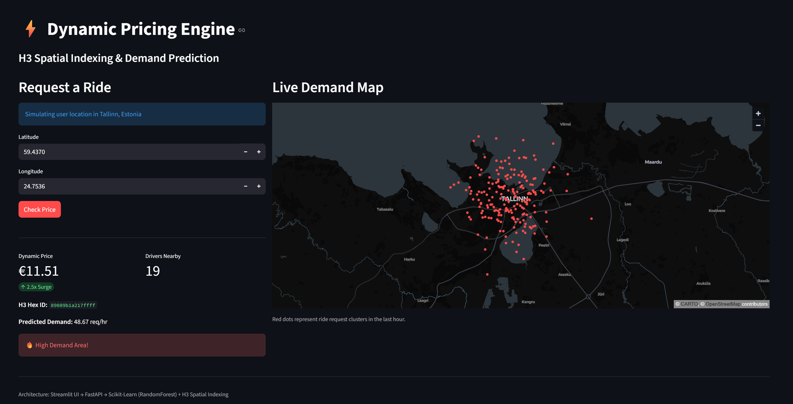
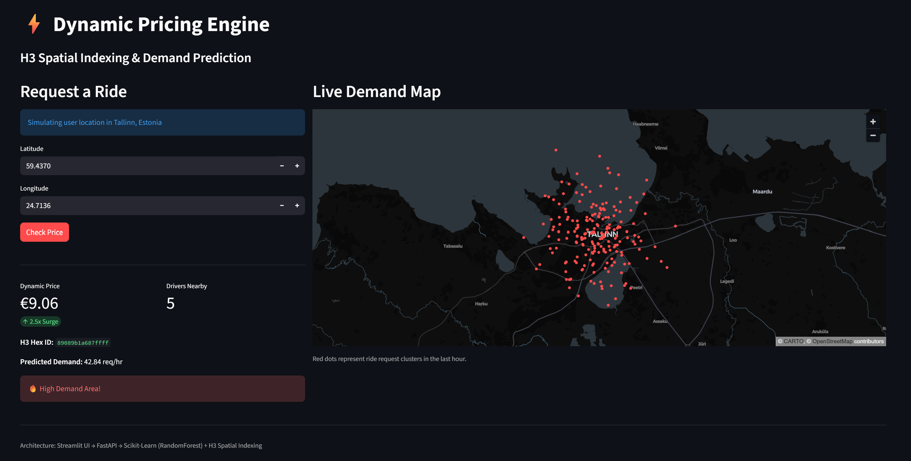

## 📸 Dashboard Preview

Dynamic Pricing Engine ⚡
A full-stack Data Science project demonstrating Geospatial Analytics, H3 Indexing, and Dynamic Pricing logic tailored for a Ride-Hailing Super App context.

🏗 ArchitectureFastAPI Backend: Handles pricing logic, demand prediction, and H3 conversions.Scikit-Learn Model: A Random Forest Regressor trained on mock historical data to predict demand based on location and time.
Streamlit Dashboard: A frontend for Operations Managers to visualize demand heatmaps and simulate pricing requests.🚀 

Setup & Run
1. Environment SetupCreate a virtual environment and install dependencies:python -m venv venv
source venv/bin/activate  # On Windows: venv\Scripts\activate
pip install -r requirements.txt
2. Run the Backend (The Engine)Open a terminal and run:uvicorn app.main:app --reload

You should see: "Pricing Engine Trained" in the logs.
3. Run the Frontend (The Dashboard)Open a second terminal and run:streamlit run ui/dashboard.py
🧪 How to useOpen the Streamlit URL (usually http://localhost:8501).You will see a 3D Map of Tallinn, Estonia. The red columns represent high-demand areas.Enter a coordinate (defaults are in Tallinn Center) and click Check Price.The system will:Convert Lat/Lon to H3 Index.Predict demand for that specific hex.Check available supply (mocked).Return a Surge Multiplier (e.g., 1.5x) if demand > supply.📂 Project Structureapp/core_logic.py: Contains the logic for the calculate_surge algorithm.app/data_gen.py: Generates synthetic GPS data clustered around Tallinn.

🐳 Run with Docker (Recommended)

This project is containerized for consistency across environments.

Ensure Docker Desktop is running.

Run the stack:

docker-compose up --build

Access the services:

Frontend Dashboard: http://localhost:8501

Backend API: http://localhost:8000

🛠 Local Setup (Legacy)

If you prefer running without Docker:

Create a virtual environment: python -m venv .venv

Install dependencies: pip install -r requirements.txt

Run Backend: uvicorn app.main:app --reload

Run Frontend: streamlit run ui/dashboard.py